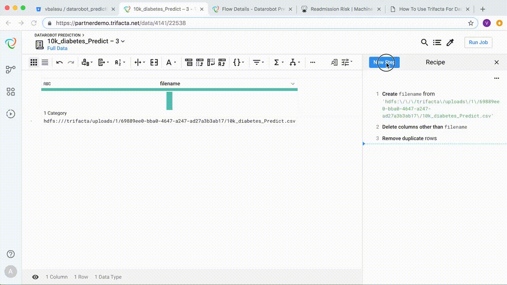

# How To Use Trifacta For DataRobot Prediction

> Which patients are more likely to be re-admitted to the hospital?

If only you could know the answer to the above question, you can take steps to greatly improve patient outcomes and deliver cost-effective care.

In this post, we will explore how to use Trifacta in conjunction with DataRobot to evaluate new patients for their risk of re-admission. Trifacta is a world-class data preparation software platform, and DataRobot is a powerful automated machine learning platform that makes it fast and easy to build and deploy accurate predictive models.

This post describes how to use Trifacta to *apply* the DataRobot prediction model to new data. It assumes that a DataRobot model to predict re-admission risk has already been trained, and is available via an API call to https://app.datarobot.com. 

The overall flow is as follows:

> A. Read new patient data &rarr; B. Call DataRobot scoring API &rarr; C. Parse and merge results

### A. Read New Patient Data

In Trifacta, create a new flow and import your prediction dataset into it.

Once imported, copy the hdfs file path and insert it into the recipe.

### B. Call DataRobot Scoring API

To call the DataRobot API, you need the following information:

1. API Token
2. Deployment ID
3. DataRobot Key
4. Username

Add a recipe step for UDF (invoke external function) and choose DatarobotPredict. Choose the filename column and enter an argument in the form API_TOKEN=api_token,DEPLOYMENT_ID=deployment_id,DATAROBOT_KEY=datarobot_key,USERNAME=username

### C. Parse and Merge Results

### Additional Links

If you are interested in how to prepare training data to feed DataRobot, please watch [this video](https://youtu.be/DafaYnJe_cs). 

For more details on the hospital readmission risk model and its implementation in DataRobot, see [this page](https://www.datarobot.com/use-cases/hospital-readmission-risk/).