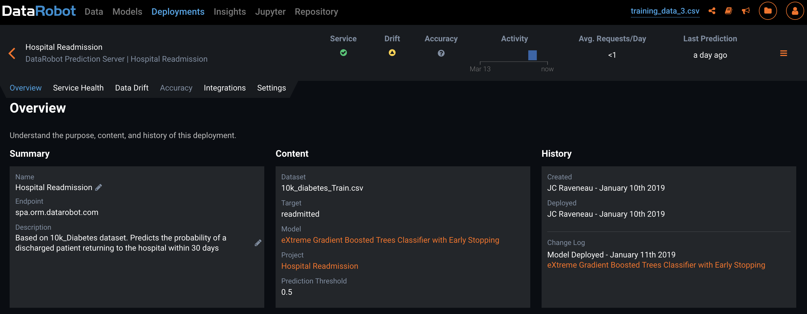
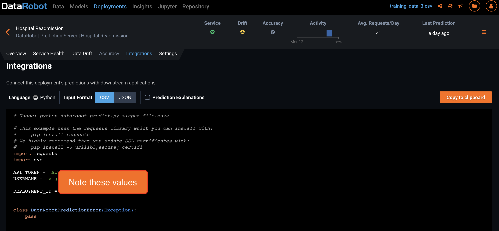
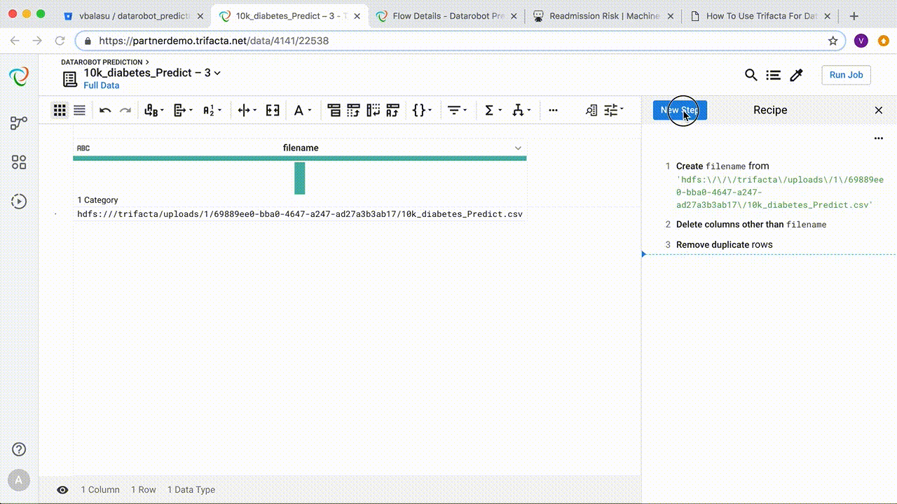

# How to realize value from machine learning? 4 steps you must complete after training your model

So you have successfully trained a machine learning model after choosing the best algorithm and high quality training data. Time to celebrate, right?

Not quite!

The best ML algorithms and models are of no use until you actually apply them to make predictions on future outcomes and incorporate those predictions into your decision making. The business value of ML is realized only when it alters behavior to produce positive outcomes.

In this post, we look at how to derive value from a DataRobot model that is designed to answer the following question:

> Which patients are more likely to be re-admitted to the hospital?

After you have trained, tested and fine-tuned your model, you need to perform the following 4 steps. 

1. Deploy the model

Make the model available for predictions. In DataRobot, you do this by creating a deployment. This involves selecting an algorithm (usually the best performing model from the training process). You also specify the training dataset which is used as a baseline to detect model drift.

 
Switch to the Integrations tab and make a note of the deployment tokens and keys. You will need them in a later step.

 
2. Predict and decide

The next step is to build a production workflow that processes incoming data and gets predictions for new patients. We do this using Trifacta. 

In Trifacta, create a new flow and import your data. In this case, we load a CSV file containing details of new patients.

Once imported, you can access the URL path to the file. Copy the URL and insert it into the recipe as shown below.

To call the DataRobot API, you need the following information:

1. API Token
2. Deployment ID
3. DataRobot Key
4. Username

Add a recipe step for UDF (invoke external function) and choose DatarobotPredict. Choose the filename column and enter an argument in the form API_TOKEN=api_token,DEPLOYMENT_ID=deployment_id,DATAROBOT_KEY=datarobot_key,USERNAME=username

 
The results of the DataRobot API call are returned in JSON format. You use Trifacta to parse out key pieces of information into their own fields. Use the flatten transformation to create individual rows in the output. Choose the prediction column along with a row identifier.

 
Now merge the prediction results with the original data to produce a combined output. This is accomplished by doing an inner join on rowId. If needed, you can perform additional transformations on this data to support analytics. 

You would now use the output of this process to drive decision making. In this case, patients having a higher readmission risk may be assigned to a nurse for additional checkups and preventive measures. All decisions and actions should be carefully recorded for later analysis.

 
After building the flow, you operationalize it using Trifacta. You do this by setting up a recurring schedule to process new patients on a daily basis. This pipeline feeds data back to the hospital's systems for the next step.

3. Measure

It is critical to measure the accuracy of the predictions, as well as the effectiveness of the decisions taken based on those predictions. 

The first part of this measurement can be implemented in DataRobot, which can detect drift in model predictions. The second part is accomplished by further analyzing patient data from the hospital's systems, and analyzing trends in cost and health outcomes. This step is important to determine the ROI of the ML initiative in terms of cost savings as well as human well-being.

4. Iterate

The process doesn't end here. To derive continued benefits from your ML initiative, you must iterate on your models to address model drift, as well as to incorporate new insights and additional data gained during the journey. Having a tight feedback loop will ensure that the ML initiative continues to provide ROI for a long time.

 
### Additional Links

The Trifacta recipes and source code used in this post are [available on Github](https://github.com/vbalasu/datarobot_prediction)

If you are interested in how to prepare training data to feed DataRobot, please watch [this video](https://youtu.be/DafaYnJe_cs). 

For more details on the hospital readmission risk model and its implementation in DataRobot, see [this page](https://www.datarobot.com/use-cases/hospital-readmission-risk/).